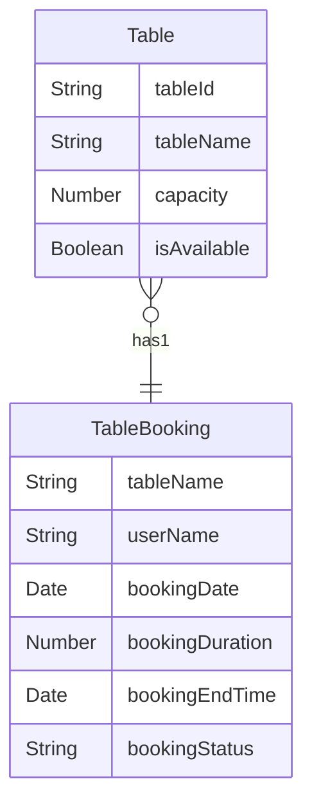

# EatFresh.TableBookingService 
This is the Tables Management microservice for the EatFresh application. This service is responsible for managing the tables in the restaurant. It provides the following functionalities:
- Add a new table
- Change the status of a table
- Delete a table
- Get all tables
- Get a table by Name

## Technologies
- BASE: Node.js (Express.js)
- Typescript and GrapghQL endpoints
- MongoDB
- Containerization with Docker
- CI/CD with Gitlab Pipeline

## Installation
1. Clone the repository
2. Run `npm install` to install the dependencies
3. Run `npm run dev` to start the server

## API Endpoints
- GET /getAllTableBookings
- GET /getAllTables
- GET /getAvailableTables
- GET /getTableBookingByUserName

- POST /CreateTable
- POST /CreateTableBooking
- POST /toggleTableAvailability
- POST /deleteTableBooking
- POST /deleteTable

## database schema

