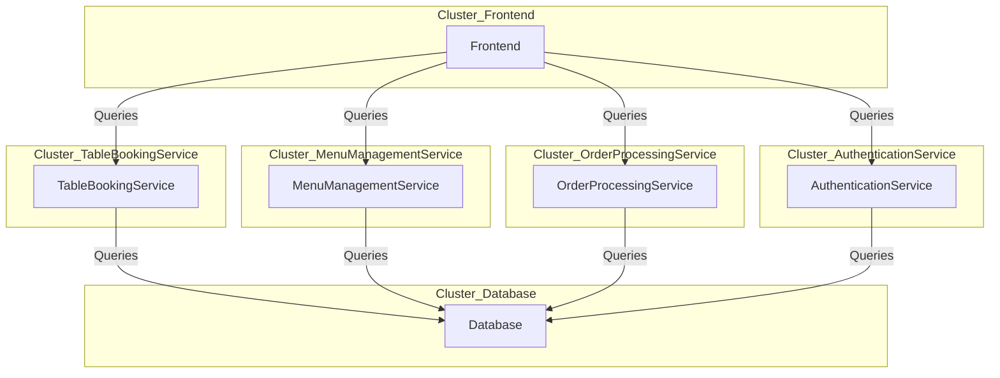
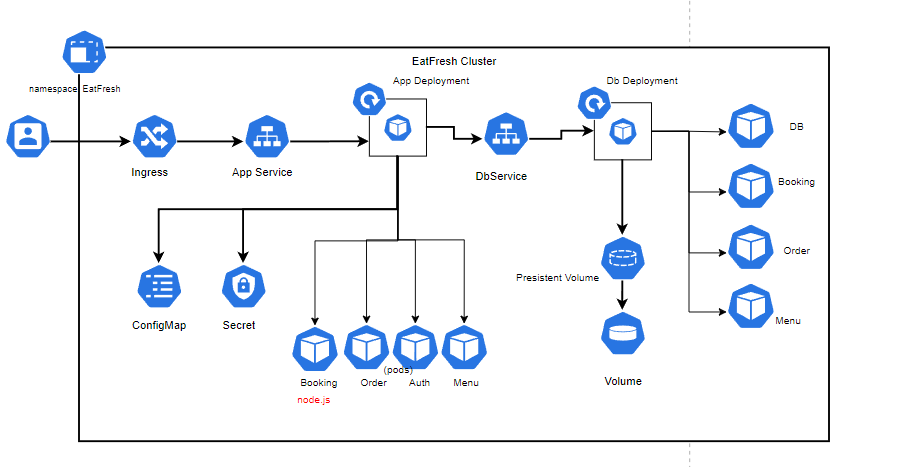
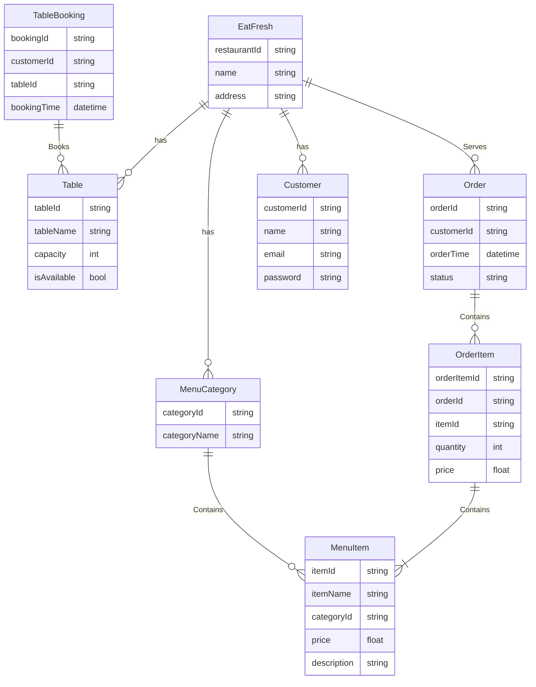
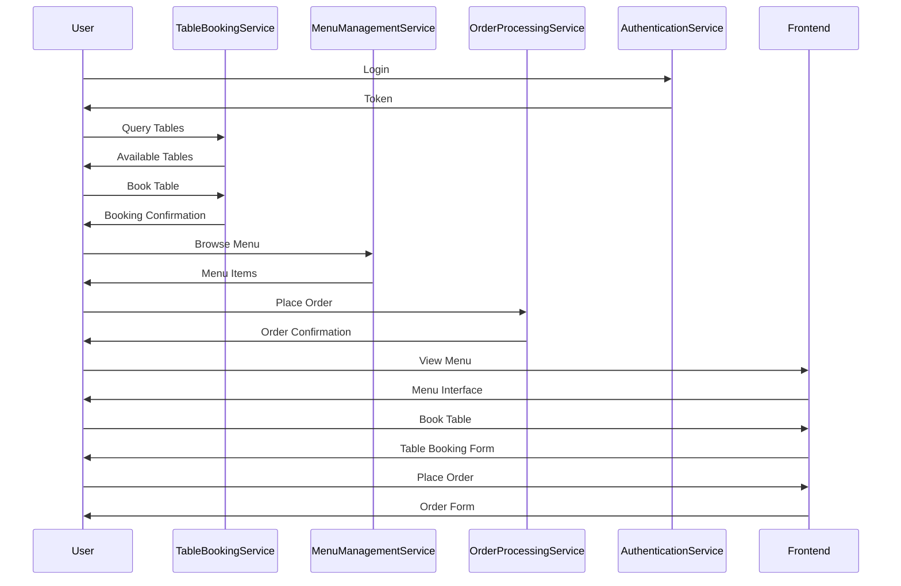
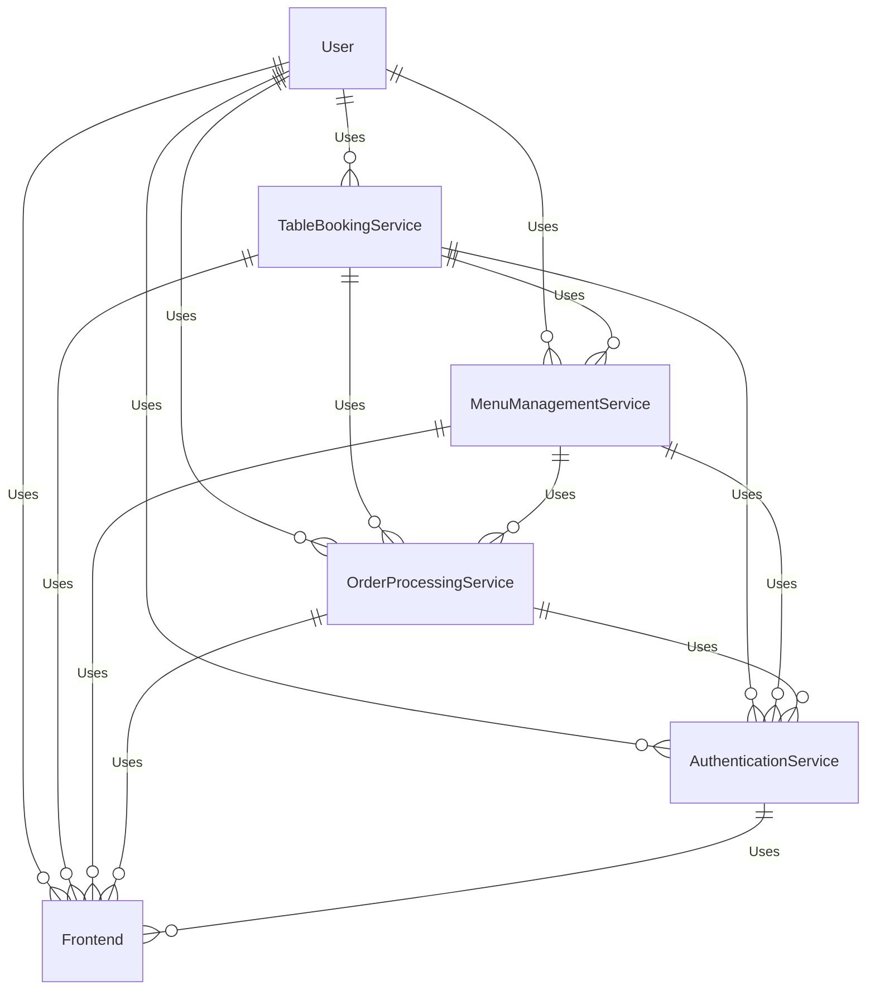

# Wao-exam

## Project " Eat Fresh Franchies "

### Tasks

**Table Booking Service:**

A microservice to handle table booking functionality.
Design database schema for storing table availability and bookings.
Develop GraphQL endpoints for querying available tables and making reservations. `Could be Node.js with Express and MongoDB.`

**Menu Management Service:**

A microservice to manage the restaurant menu.
Define database schema for storing menu items and categories.
Implement RESTFull endpoints for querying menu items and updating menu content.
`Could be .net core with SQL Server.`

**Order Processing Service:**
A microservice responsible for processing customer orders.
Design database schema for storing order details and status.
Implement RESTFull endpoints for placing orders and tracking order status.
`Could be .net core with SQL Server.`

**Authentication Service:**

OAuth 2.0 and OpenID Connect for user authentication and authorization.
Implement authentication service to handle user login and access control.
(Admin Access to menu management)

**Frontend Development:**

a basic frontend interface for customers to interact with the system.
Include features for table booking, menu browsing, and order placement.
Ensure integration with authentication service for secure user access.
`Could be SPA with React.js and Apollo Client.`

## Technologies Used

<table>
<thead>
    <tr>
    <th>Technology</th>
    <th>Applied to</th>
    <th>Use Case in Project</th>
    </tr>
</thead>
<tbody>
    <tr>
    <td><b>Node.js with Express.js (TypeScript)</td>
    <td>Backend Service: Table Booking</td>
    <td>Backend logic for table booking service, utilizing TypeScript for enhanced code maintainability.</td>
    </tr>
    <tr>
    <td><b>.NET Core (C#)</td>
    <td>Backend Services: Menu Management, Order Processing</td>
    <td>Backend logic for menu management and order processing services, leveraging the power of C# for enterprise-grade applications.</td>
    </tr>
    <tr>
    <td><b>RabbitMQ</td>
    <td>Backend Services: Table Booking, Menu Management, Order Processing</td>
    <td>Asynchronous messaging between microservices, ensuring decoupling and fault tolerance.</td>
    </tr>
    <tr>
    <td><b>gRPC</td>
    <td>Backend Services: Table Booking, Menu Management, Order Processing</td>
    <td>Inter-service communication for efficient and reliable data exchange between microservices.</td>
    </tr>
    <tr>
    <td><b>Handling Concurrency Conflicts</td>
    <td>Backend Services: Table Booking, Menu Management, Order Processing</td>
    <td>Implementation of conflict resolution mechanisms to maintain data consistency and integrity.</td>
    </tr>
    <tr>
    <td>Kubernetes Concepts</td>
    <td>Infrastructure: Kubernetes Cluster</td>
    <td>Management and scaling of microservices deployment, ensuring high availability and resilience.</td>
    </tr>
    <tr>
    <td><b>Kubernetes</td>
    <td>Infrastructure: Kubernetes Cluster</td>
    <td>Implementation of security best practices for securing microservices deployment in Kubernetes.</td>
    </tr>
    <tr>
    <td><b>API Gateway</td>
    <td>Infrastructure: API Gateway</td>
    <td>Centralized entry point for clients to access microservices, providing security, scalability, and performance benefits.</td>
    </tr>
    <tr>
    <td><b>SAGA Pattern</td>
    <td>Microservices Architecture</td>
    <td>Management of distributed transactions to ensure data consistency across multiple services.</td>
    </tr>
</tbody>
</table>

# Microservices Architecture

# Cluster deployment Diagram

# DATABASE SCHEMA

## Microservices in Action

## Microservices in the application

